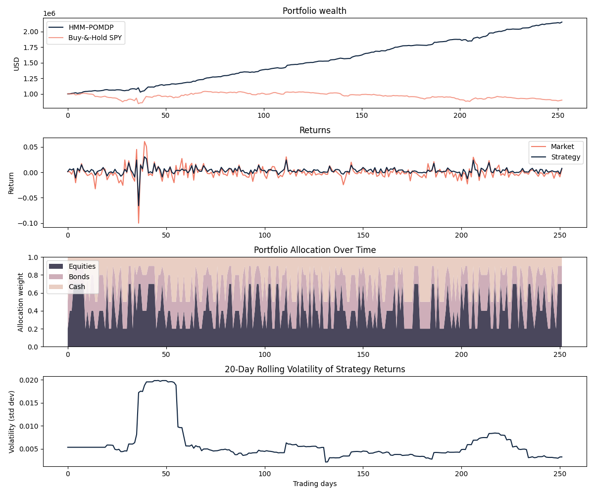

# A Bayesian Hidden Markov Model & POMDP Framework for Regime-Adaptive Asset Allocation
June 2025

---

  <!-- Optional status / CI badges -->
  <!--  -->
  <!--  -->

## Abstract
This repository contains the full implementation of a **regime-aware asset-allocation strategy** that  
1. learns hidden market regimes with a **Bayesian Hidden Markov Model (HMM)**, and  
2. allocates capital dynamically via a **Partially Observable Markov Decision Process (POMDP)**.  

Daily equity returns (SPY) and key macroeconomic indicators (Fed Funds Rate, CPI, GDP) feed the model.  
Back-tests on recent market data highlight superior risk-adjusted performance relative to a static benchmark.

---

## Table of Contents
1. [Introduction](#introduction)  
2. [Project Goals](#project-goals)  
3. [Methodology](#methodology)  
   - [Data Acquisition](#data-acquisition)  
   - [Bayesian HMM](#bayesian-hmm)  
   - [POMDP Formulation](#pomdp-formulation)  
4. [Results](#results)  

---

## Introduction
Financial markets exhibit **regime shifts** driven by economic, geopolitical and behavioural forces.  
Traditional portfolio methods that assume stationarity can falter during such transitions.  
We instead model returns with an HMM to _infer_ regimes, then decide allocations with a POMDP that  
updates **belief states** online:

$$
r_t = \ln P_t - \ln P_{t-1}, \qquad \pi_t(s) \propto P(o_t \mid s)\sum_{s'}P(s\mid s') \pi_{t-1}(s').
$$

---

## Project Goals
- **Custom Bayesian HMM** for joint modelling of equity returns and macro data.  
- **POMDP allocation engine** with regime-conditioned weight choices $(0.7,0.2,0.1),(0.4,0.4,0.2),(0.2,0.3,0.5)$.  
- **Reproducible pipeline** (data → modelling → decision → visualisation).  
- **Performance analysis** — wealth curves, rolling volatility, regime timelines.

---

## Methodology

### Data Acquisition
| Source | Variable | Freq. | Notes |
|--------|----------|-------|-------|
| Alpha Vantage | SPY Adj-Close | Daily | Log-returns |
| Alpha Vantage | Fed Funds Rate | Monthly | Interpolated |
| Alpha Vantage | CPI | Monthly | Inflation |
| Alpha Vantage | Real GDP | Quarterly | Chained dollars |

Missing values are forward/back-filled before model ingestion.

### Bayesian HMM 
Two latent states—**Bull** and **Bear**—follow a Markov chain  
$A=[a_{ij}]=P(z_t=j\mid z_{t-1}=i)$. Emissions are multivariate Gaussians

$$
p(\mathbf{x}_t\mid z_t=k) \sim \mathcal N \bigl(\mathbf{x}_t\big| \mu_k,\Sigma_k\bigr),
$$

with parameters fitted by the Baum–Welch EM algorithm.

### POMDP Formulation
> **States:** hidden regimes \
> **Actions:** 3 asset-weight vectors \
> **Observations:** returns + macro signals \
> **Reward:** portfolio log-return `R_t = log(W_t / W_{t-1})` with wealth update: `W_{t+1} = W_t * (1 + w_{a_t}^T · r_t)`

The belief $\pi_t$ is updated with the HMM forward filter; a policy (currently ε-greedy demo) selects actions.

---

## Results

  

The strategy doubles capital over one trading year. 
Rolling volatility remains consistently below the market, evidencing effective downside control.

